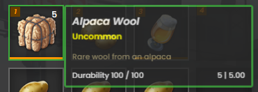
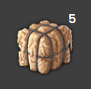
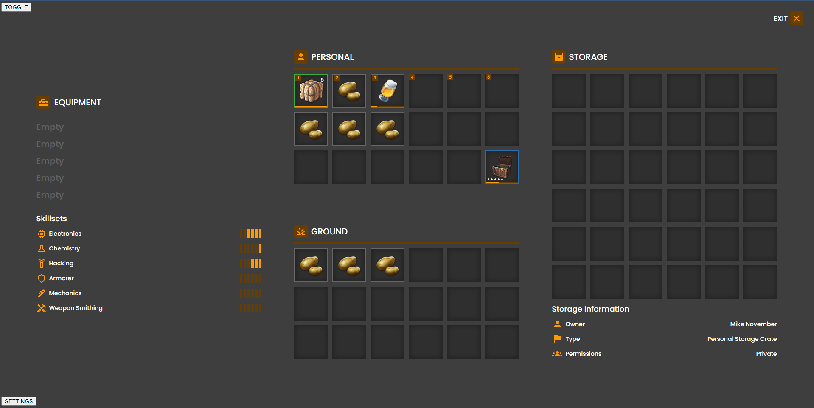

# Game Inspired Inventory System

## Jonathan Meisner

## How to run

Use `yarn` or `npm install` after cloning the repository

Use `yarn dev` or `npm dev` to start the local instance

## Screenshots

